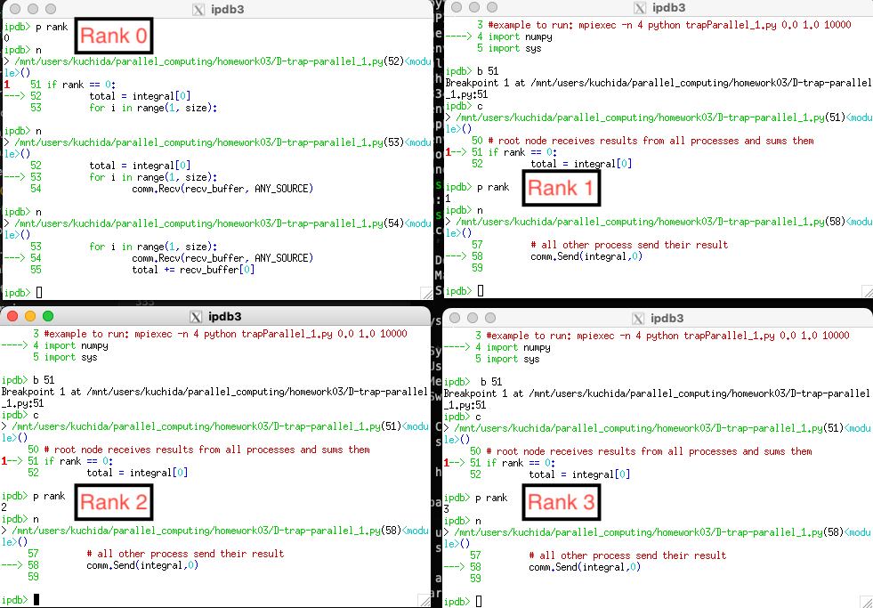

## Exercise 3.1

I think that the inefficiency comes from
- creating random matrics
- copying the metrics
- computing Ax and maximum error
These are now updated with np.random.rand, .copy(), and np.matmul(), np.max().

To debug this solution, I used numpy.testing.

```python
import numpy as np

def solver(a,b): # LU-factorisation
    for k in range(n):
        # for i in range(k+1,n):
        #     a[i][k] = a[i][k] / a[k][k]
        # for j in range(k+1,n):
        #     for i in range(k+1,n):
        #         a[i][j]=a[i][j]-a[i][k]*a[k][j]
        a[k + 1:, k] /= a[k, k]
        a[k + 1:, k + 1:] -= np.outer(
            a[k + 1:, k],
            a[k, k + 1:]
        )

    # y=[] # forward substitution - solve Ly=b
    # y.append(b[0])
    # for i in range(1,n):
    #     y.append(b[i])
    #     for j in range(i):
    #         y[i]=y[i]-a[i][j]*y[j]
    y = np.empty(n)
    for i in range(n):
        y[i] = b[i] - a[i, :i] @ y[:i]

    # x=[] # backward substitution - solve Ux=y
    # for i in range(n):
    #     x.append(0.0)
    # x[n-1]=y[n-1]/a[n-1][n-1]
    # for i in range(n-2,-1,-1):
    #     x[i]=y[i]
    #     for j in range(i+1,n):
    #         x[i] = x[i]-a[i][j]*x[j]
    #     x[i] = x[i] / a[i][i]

    x = np.empty(n)
    for i in range(n - 1, -1, -1):
        x[i] = (
            y[i] - a[i, i + 1:] @ x[i + 1:]
        ) / a[i, i]
    return x

# a=[]
# for i in range(n):
#     a.append([])
#     for j in range(n):
#         a[i].append(random.random())
a = np.random.rand(n, n)

# b=[]
# for i in range(n):
#     b.append(random.random())
b = np.random.rand(n)

# aa=list(a)
# for i in range(n):
#     aa[i]=list(a[i])
aa = a.copy()

x=solver(a,b)
# check the result - we ensure that matrix-vector application Ax to obtained
# solution indeed gives a vector that is fairly closed to desired vector b:
# z=[]
# me=0.0
# for i in range(n):
#     z.append(0.0)
#     for j in range(n):
#         z[i]=z[i] + aa[i][j]*x[j]
#     e=abs(z[i]-b[i])
#     if e > me:
#         me=e
z = np.matmul(aa, x)
me = np.max(np.abs(z - b))
```

```{python}
import subprocess

result = subprocess.run(
    ["python", "A-numpy.py"],
    capture_output=True,
    text=True,
    check=True,
)
print(result.stdout)
```

```{python}
import contextlib
import importlib.util
import io
from statistics import median
from time import perf_counter

import matplotlib.pyplot as plt
import numpy as np

def load_file(name, path):
    spec = importlib.util.spec_from_file_location(name, path)
    module = importlib.util.module_from_spec(spec)
    with contextlib.redirect_stdout(io.StringIO()):
        spec.loader.exec_module(module)
    return module

pythonlist = load_file("pythonlist", "A-pythonlist.py")
numpy_version = load_file("numpy_version", "A-numpy.py")
linalg = load_file("linalg", "A-linalg.py")

sizes = range(10, 501, 10)
# sizes = range(10, 21, 10)
times = {"Python lists": [], "NumPy arrays": [], "numpy.linalg.solve": []}

for n in sizes:
    rng = np.random.default_rng(2026)
    a = rng.random((n, n))
    b = rng.random(n)

    for name, module in [
        ("Python lists", pythonlist),
        ("NumPy arrays", numpy_version),
        ("numpy.linalg.solve", linalg),
    ]:
        module.n = n
        measurements = []
        for _ in range(5):
            if name == "Python lists":
                a_run, b_run = a.tolist(), b.tolist()
            else:
                a_run, b_run = a.copy(), b.copy()

            start = perf_counter()
            x = module.solver(a_run, b_run)
            measurements.append(perf_counter() - start)

        np.testing.assert_allclose(a @ np.asarray(x), b, rtol=1e-5, atol=1e-5)
        times[name].append(median(measurements))
```

Each point is the median of five runs. The random seed is 2026.

```{python}
for name in ["Python lists", "NumPy arrays", "numpy.linalg.solve"]:
    plt.plot(sizes, times[name], label=name)

plt.xlabel("n")
plt.ylabel("Median time (seconds)")
plt.legend()
plt.grid()
plt.show()

for name in ["Python lists", "NumPy arrays", "numpy.linalg.solve"]:
    speedup = np.array(times["Python lists"]) / np.array(times[name])
    plt.plot(sizes, speedup, label=name)

plt.xlabel("n")
plt.ylabel("Speedup over Python lists")
plt.legend()
plt.grid()
plt.show()
```

## Exercise 3.2

I understand that MPI is for handling multiple program that has its own memory (Threads have shared memory). 

```python
from mpi4py import MPI
import numpy as np

comm = MPI.COMM_WORLD
rank = comm.Get_rank()

# sending message from 0 to 1.
if rank == 0:
    data = {"message": "hello", "number": 123}
    comm.send(data, dest=1)
elif rank == 1:
    data = comm.recv(source=0)
    print("1. recv:", data)

# Waiting for all processes to finish. 
comm.Barrier()


# Async communication.
if rank == 0:
    request = comm.isend("async hello", dest=1)
    request.wait()
elif rank == 1:
    request = comm.irecv(source=0)
    data = request.wait()
    print("2. irecv:", data)

comm.Barrier()

# Sending Object by using Send(), Recv().
if rank == 0:
    numbers = np.array([1.0, 2.0, 3.0], dtype=np.float64)
    comm.Send([numbers, MPI.DOUBLE], dest=1)
elif rank == 1:
    # we need to set the memory space.
    numbers = np.empty(3, dtype=np.float64)
    comm.Recv([numbers, MPI.DOUBLE], source=0)
    print("3. Recv:", numbers)
```

```{python}
result = subprocess.run(
    ["mpirun", "-n", "4", "python", "B-MPI-tutorial.py"],
    capture_output=True,
    text=True,
    check=True,
)
print(result.stdout)
```

```{python}
result = subprocess.run(
    ["mpiexec", "-n", "4", "python", "C-hello-mpi.py"],
    capture_output=True,
    text=True,
    check=True,
)
print(result.stdout)
```

## Excercise 3.2.1

I think the key point is adding the tag to prevent the deadlock of this communication.
For me it looks like lamport-clock in distributed system.

```python
def return_3rd(source, dest, tag, items):
    rank = comm.Get_rank()

    if rank == source:
        comm.send(items, dest=dest, tag=tag)
        return comm.recv(source=dest, tag=tag + 1)

    if rank == dest:
        received = comm.recv(source=source, tag=tag)
        comm.send(received[2], dest=source, tag=tag + 1)
        return received

    return None
```

```{python}
result = subprocess.run(
    ["mpiexec", "-n", "4", "python", "C-return_3rd-3.2.1.py"],
    capture_output=True,
    text=True,
    check=True,
)
print(result.stdout)
```

## Excercise 3.2.2

Waiting at each communication is important. 

```python
def return_3rd_nonblocking(source, dest, tag, items):
    rank = comm.Get_rank()

    if rank == source:
        request = comm.isend(items, dest=dest, tag=tag)
        print("process", rank, "starting first wait")
        request.wait()

        request = comm.irecv(source=dest, tag=tag + 1)
        print("process", rank, "starting second wait")
        return request.wait()

    if rank == dest:
        request = comm.irecv(source=source, tag=tag)
        print("process", rank, "starting first wait")
        received = request.wait()

        request = comm.isend(received[2], dest=source, tag=tag + 1)
        print("process", rank, "starting second wait")
        request.wait()
        return received

    return None
```

And I basically copied the return_3rd-3.2.1.py and replaced the return function.  

```{python}
result = subprocess.run(
    ["mpiexec", "-n", "4", "python", "C-return_3rd_nonblocking-3.2.2.py"],
    capture_output=True,
    text=True,
    check=True,
)
print(result.stdout)
```

## Excercise 3.2.3

I understand that 'Send()' is more low level. It handles contiguous array in the memory.
So, before using Send(), we need to .copy() and make new contiguous array. 

```python
def return_every_3rd_number(source, dest, tag, items):
    rank = comm.Get_rank()

    if rank == source:
        comm.Send(items, dest=dest, tag=tag)
        returned = np.empty_like(items[::3])
        comm.Recv(returned, source=dest, tag=tag + 1)
        return returned

    if rank == dest:
        status = MPI.Status()
        comm.Probe(source=source, tag=tag, status=status)
        count = status.Get_count(MPI.DOUBLE)
        received = np.empty(count, dtype=np.float64)
        comm.Recv(received, source=source, tag=tag)
        comm.Send(received[::3].copy(), dest=source, tag=tag + 1)
        return received

    return None
```

```{python}
result = subprocess.run(
    ["mpiexec", "-n", "4", "python", "C-return_every_3rd_number-3.2.3.py"],
    capture_output=True,
    text=True,
    check=True,
)
print(result.stdout)
```

## Excercise 3.2.4

We can add barrier after if else block.
This Barrier() waits until all ranks are sending its integral to rank 0. 

```python
# communication
# root node receives results from all processes and sums them
if rank == 0:
        total = integral[0]
        for i in range(1, size):
                comm.Recv(recv_buffer, ANY_SOURCE)
                total += recv_buffer[0]
else:
        # all other process send their result
        comm.Send(integral,0)

comm.Barrier()

# root process prints results
if comm.rank == 0:
        print("With n =", n, "trapezoids, our estimate of the integral from"\
        , a, "to", b, "is", total)

```

```{python}
result = subprocess.run(
    ["mpiexec", "-n", "4", "python", "D-trap-parallel_1.py", "0.0", "1.0", "10000"],
    capture_output=True,
    text=True,
    check=True,
)
print(result.stdout)
```


Task B 
Screenshot is here.


